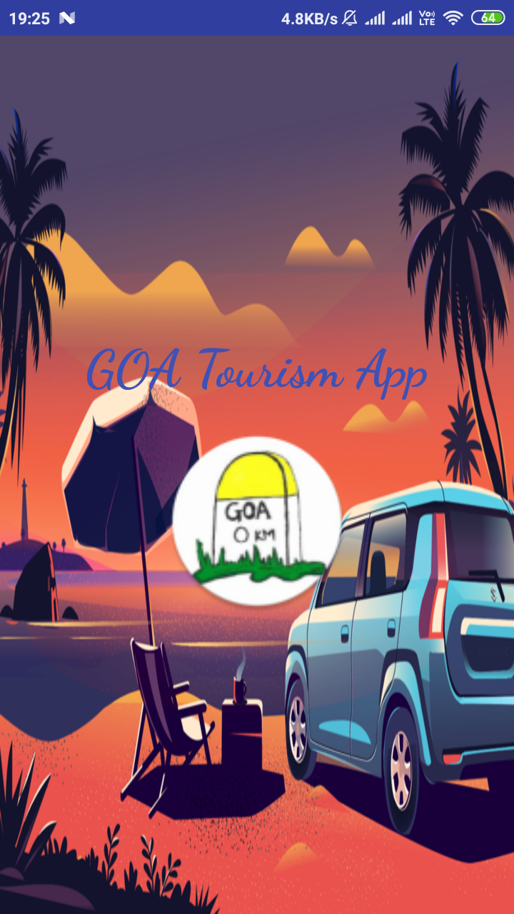
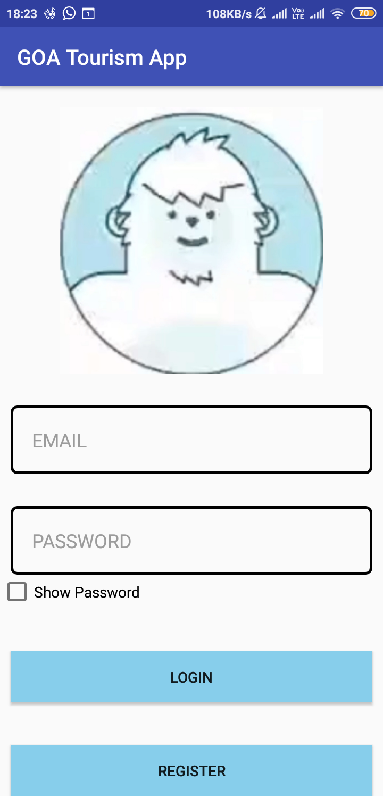
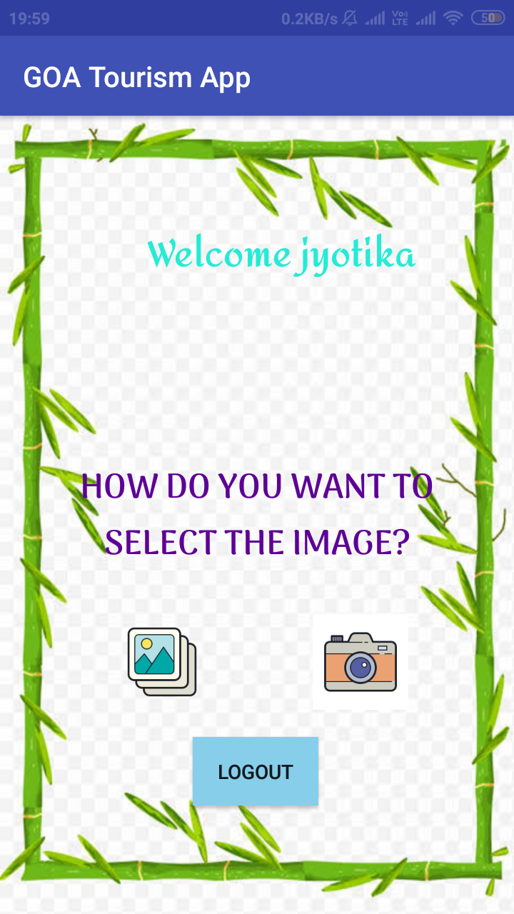
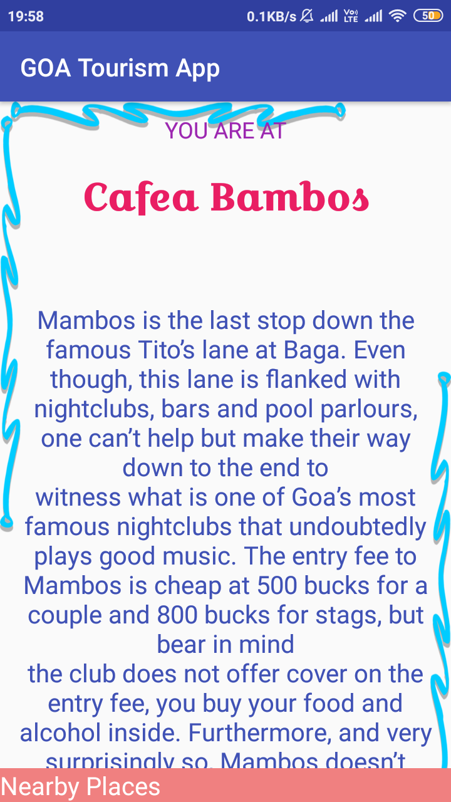
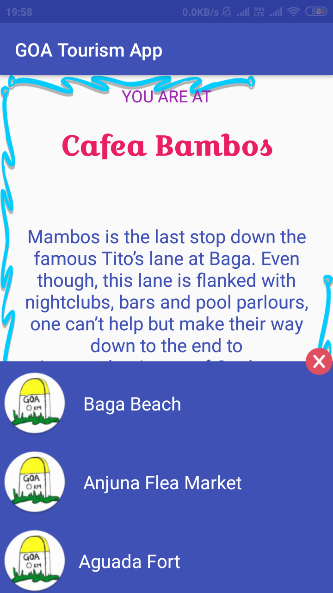
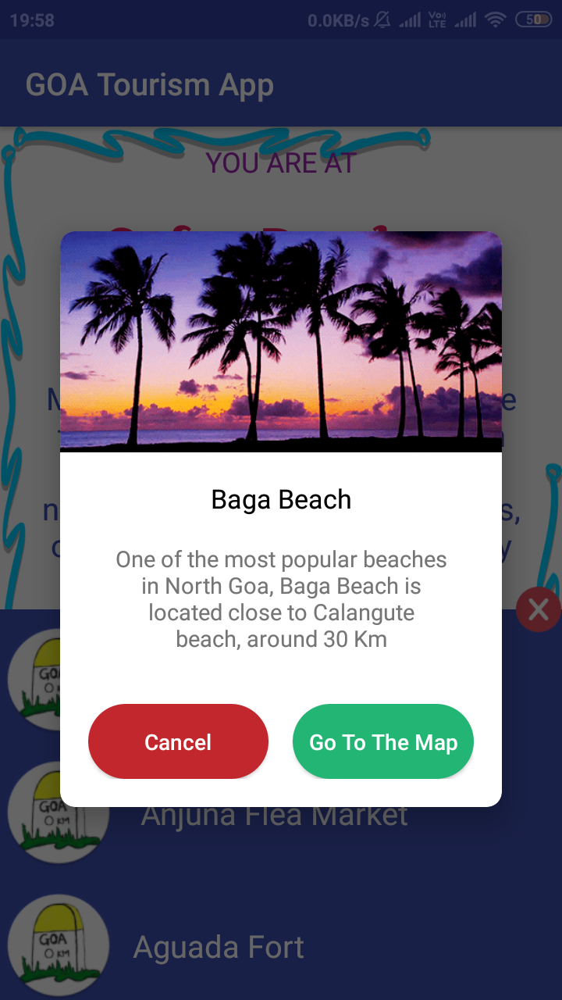

# Goa-Virtual-Tourism-App
Due to high inflow of tourists , the manpower required to guide the tourists on landmarks in goa is not sufficient and the guides sometimes lack in the information that is needed to be given and highlighted to the tourist.

Mobile application which will act as a virtual guide for the tourists visiting GOA . Users can gather information (history about monuments, related facts ,timings , nearby tourist places, things to do etc.) about the monuments simply by the capturing live photographs of various monuments , beaches , cafes , etc. 
## TECH STACK:
PYTHON  
JAVA 
SQLite 
Google Maps API 
Data Collection 
Image Processing 
MACHINE LEARNING 
### Libraries used: 
Selenium  
BeautifulSoup 
TensorflowLite 
# Screenshots
SplashScreen  
 
Login Page  
 
Uploading Picture  
 
Monument Facts  
 
Nearby Places  
 
Quick look at neraby places  

